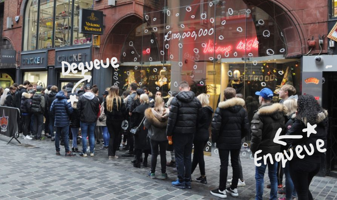

# Queue


A queue is a list of data that's order is important. In a queue, the first element added to the list should be the first element to be removed from the list. Queues can be seen while using software components, web servers, and even in shopping malls. An example of a queue would be seen on Black Friday. There are customers queuing to enter the store to buy the sale items. 

## Enqueue and Dequeue
On Black Friday, there are lines of people outside waiting to enter the store. When the first person in the queue enters the store, that is called a **dequeue**. Dequeuing is for the customers in the front of the queue. When a new person joins the back of the queue to enter, that is called an **enqueue**. Enqueuing is for customers in the back of the queue. 



## Common Operations
Operation | Efficiency | Description 
----------|------------|-------------
Enqueue(value) | O(1) | Add a value to the back of the queue
Dequeue(value) | O(1) | Remove a value from the queue 
Count | O(1) | Count the number of elements
Empty | O(1) | Boolean to check if the queue is empty

## Example
Below is a simple example of how to use some of the common operations in code:

```csharp
public static void Main() {
    // create a list for the queue
    public readonly List<Person> _queue = new();

    // enqueue
    _queue.Enqueue(item2);

    // dequeue
    _queue.Dequeue(item1);

    // check to see if the queue is empty
    if (_queue.Count == 0){
        Console.WriteLine("The queue is empty")
    }
    else {
        // count number of items are in the queue
        Console.WriteLine($"There are {_queue.Count} items in the queue.")
    }

}

```


## Problem to Solve: Black Friday Shopping


You are the cashier at Macy's for Black Friday. There are so many customers in the store! Write a program to help you make sure the first customer in line is the first person to be checked out. 

### Requirements:
1. The customer that is in line first should be dequeued first
2. When a new customer joins the queue, enqueue them to the back of the queue
3. When it is the end of the night and there are no shoppers left, there should be a display message to say that the queue is empty


See the solution here: [Solution](queue-problem-solution)