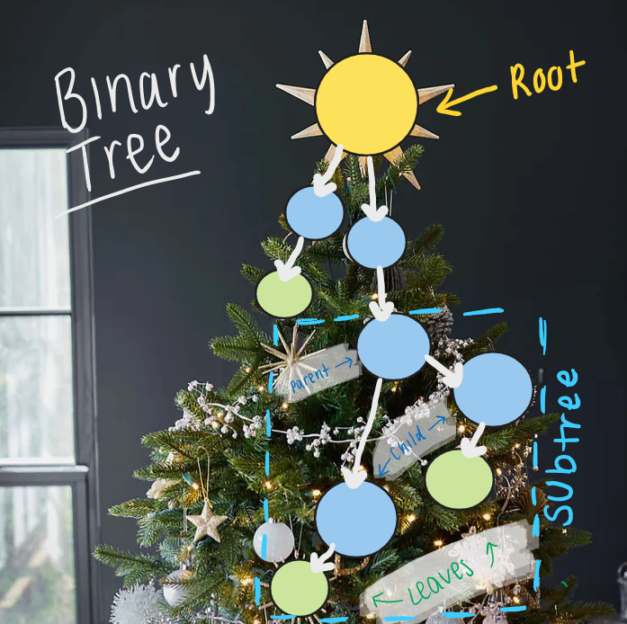

# Trees


Trees connect nodes together using pointers. Trees are similar to linked lists because they link nodes together, but they are different because trees can connect to multiple nodes instead of just one in a linked list. There are three types of trees: binary trees, binary search trees, and balanced search trees. Trees are only helpful if they are balanced. 

## Binary Trees
The Christmas tree above can be looked at like a binary tree if we make the ornaments into nodes. The node at the top of the tree is called the root node. There is always only one root, as there is only one star on the top of the Christmas tree. The nodes at the bottom that do not connect to other nodes are called leaf nodes. Inside the tree, there is a subtree. The node at the top of the subtree is called the parent node. Each node that connects to the parent node is called a child node. 



## Binary Search Trees
If we add data to the binary tree, it will become a binary search tree. When adding data to the binary search tree, if the data is greater than the root node, it will connect to the right side. If the data added is less than the root node, it will connect to the left side. The data is sorted into subtrees on the right and left sides of the root node. 


## Recursive Functions
Recursive functions are functions that call themselves. Many of the common operations of trees are used with recursion. This is because with binary trees, there are many operations that search through the already sorted tree. It is also helpful to use recursion in trees because when an operation is applied to one node, it can also apply to all of the other nodes in the tree. 


Below is an example of a recursive function to iterate through a binary search tree:

```csharp
public IEnumerable Reverse() {
        var numbers = new List<int>();
        TraverseBackward(_root, numbers);
        foreach (var number in numbers) {
            yield return number;
        }
    }

    private void TraverseBackward(Node? node, List<int> values) {
        if (node is not null) {
            TraverseBackward(node.Right, values); //recursive
            values.Add(node.Data);
            TraverseBackward(node.Left, values);
        }
    }
```


## Common Operations
Operation | Efficiency | Description 
----------|------------|-------------
Insert(value) | O(logn) | Insert a value 
Remove(value) | O(logn) | Remove a value 
Contains(value) | O(logn) | Determine if value is present 
Traverse Forward | O(n) | Recursively search the tree from least to greatest 
Traverse Reverse | O(n) | Recursively search the tree from nodes greatest to least 
Height(node) | O(n) | Find the height of a node 
Size | O(1) | Find the size of the tree
Empty() | O(1) | Boolean to check if the root node is empty 

## Example
Below is a simple example of how to use some of the common operations of trees in code:

```csharp
// insert values into the tree
public void Insert(int value) {
        if (_root is null)
            _root = new Node(value);
        else
            _root.Insert(value); 
    }

// check if the value is in the tree
public bool Contains(int value) {
        return (_root != null && _root.Contains(value));
    }

// iterate through the tree
public IEnumerator<int> GetEnumerator() {
        var numbers = new List<int>();
        TraverseForward(_root, numbers);
        foreach (var number in numbers) {
            yield return number;
        }
    }

private void TraverseForward(Node? node, List<int> values) {
        if (node is not null) {
            TraverseForward(node.Left, values);
            values.Add(node.Data);
            TraverseForward(node.Right, values);
        }
    }

// find the height of the node
public int GetHeight() {
        if (_root is null)
            return 0;
        return _root.GetHeight();
    }
```

## Problem to Solve : Christmas Dinner Attendees
Now it is your turn to apply what you have learned and solve a problem using trees. You have been tasked to create a tree of who is bringing a dish and how many people it feeds. Your mom created a tree a few weeks ago, but it needs some updates.

### Requirements:
1. Aunt Gina is bringing a ham that serves 20 people. Add her to the tree.
2. Uncle Roger is bringing potatoes to feed 12 people. Add him to the tree.
3. Your brother originally said he would bring a pie to serve 8 people, but now he will not. Remove him from the tree.
4. Find how many dishes serve less than 6 people.


See the solution here: [Solution](tree-problem-solution)

